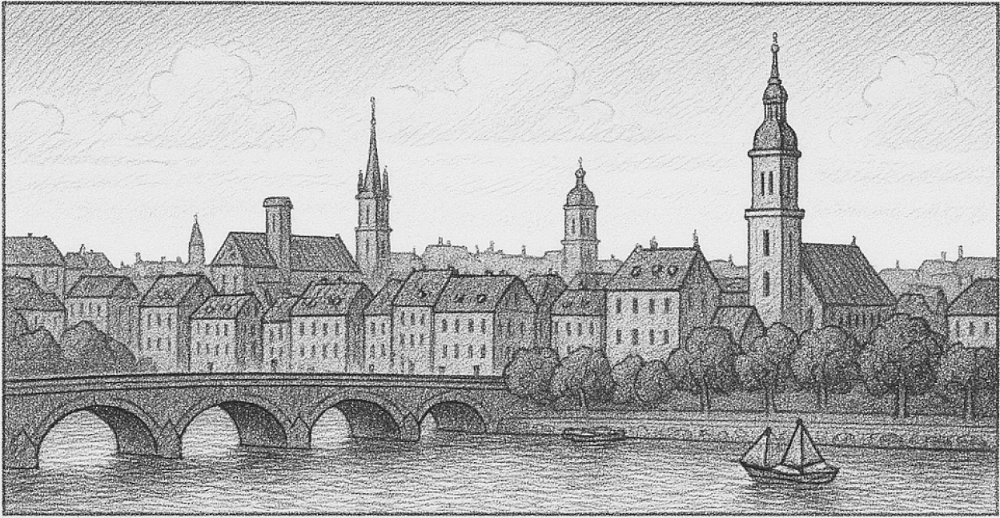
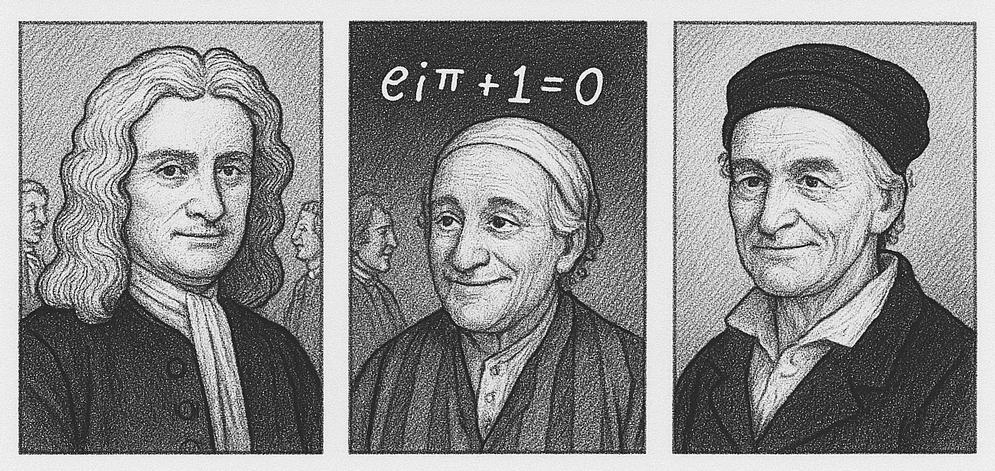
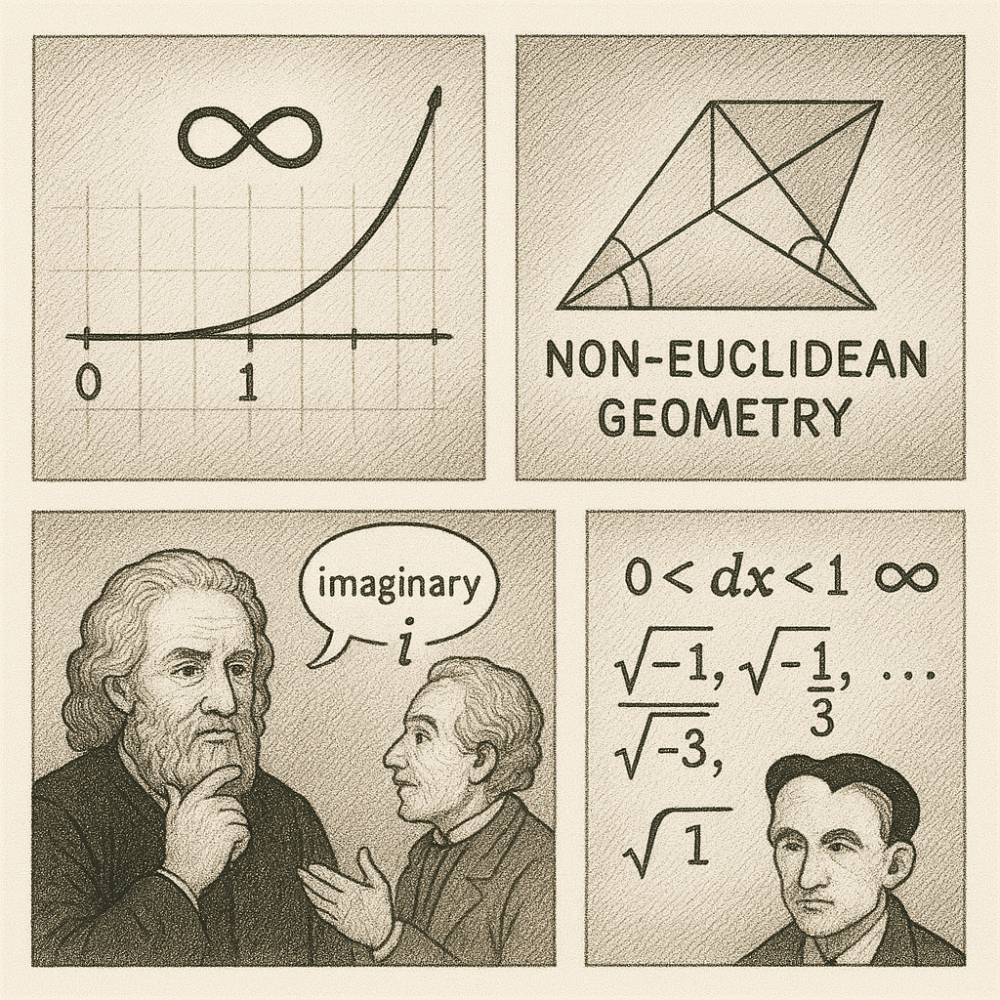
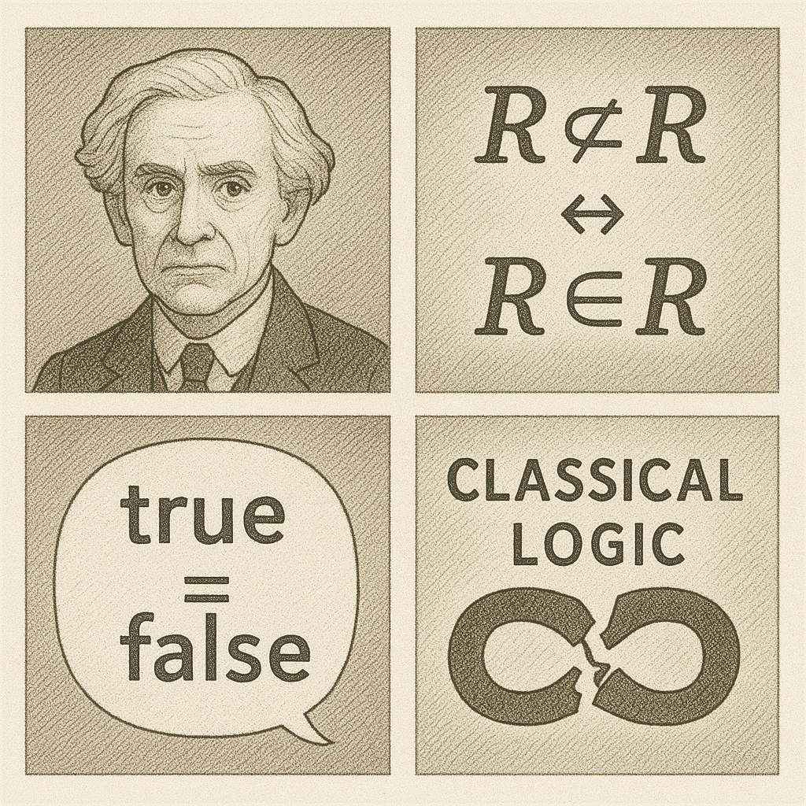
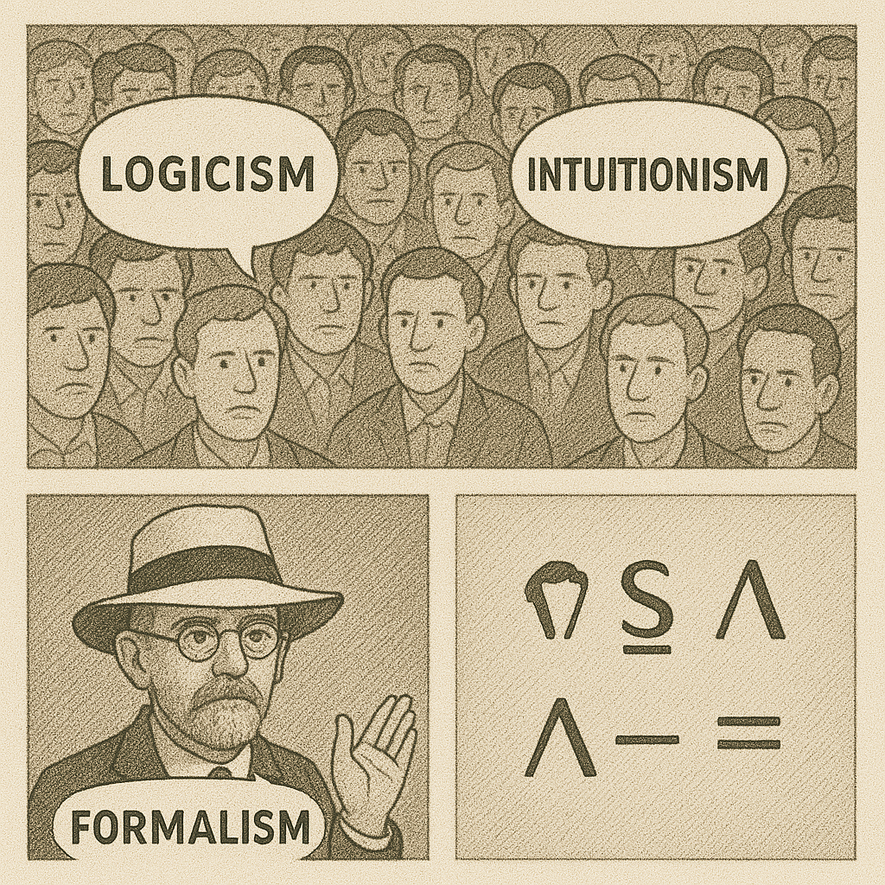

# Slide 1: The Golden Age of Confidence (Mid-1800s)



In the mid-1800s, mathematics seemed almost complete. Centuries of progress — from Newton and Leibniz to Gauss and Euler — had given people a deep confidence in the power and consistency of mathematics. The belief was: all mathematical truths could, eventually, be discovered with the right tools.




# Slide 2: The Trouble with Infinity

But things were not as settled as they seemed. Concepts like infinity, infinitesimals, and imaginary numbers — though used — were not fully understood. Then, non-Euclidean geometry was discovered, showing that even the "truth" of geometry wasn't absolute. These challenged the idea that mathematics rested on solid, self-evident foundations.




# Slide 3: The Crisis — Russell’s Paradox (Early 1900s)

The breaking point came with paradoxes in set theory — especially Russell’s Paradox, which revealed contradictions at the heart of naive set theory. It called into question the entire logical foundation of mathematics. If math could lead to contradiction, how could it be trusted?




# Slide 4: The Foundational Quest

In response, multiple schools of thought emerged: logicism, formalism, and intuitionism. A major thread among them was the search for a formal system — a way to represent mathematics purely symbolically, with unambiguous rules, to avoid paradox.




# Slide 5: Formal Systems and Symbolic Logic

The idea was to express mathematics using a strict symbolic language, with precise syntax and rules of inference — like a mathematical grammar. If mathematics could be reduced to symbols manipulated by rules, then perhaps its consistency could be proven.


# Slide 6: The Birth of Lambda Calculus

It was in this climate that Alonzo Church developed lambda calculus, a formal system for defining functions and computation using symbolic abstraction. It wasn’t just about math — it became a foundation for logic, programming languages, and the theory of computation.


```
(λp.λq. p q p) (λa.λb. a) (λa.λb. b) = λa.λb. b
```

